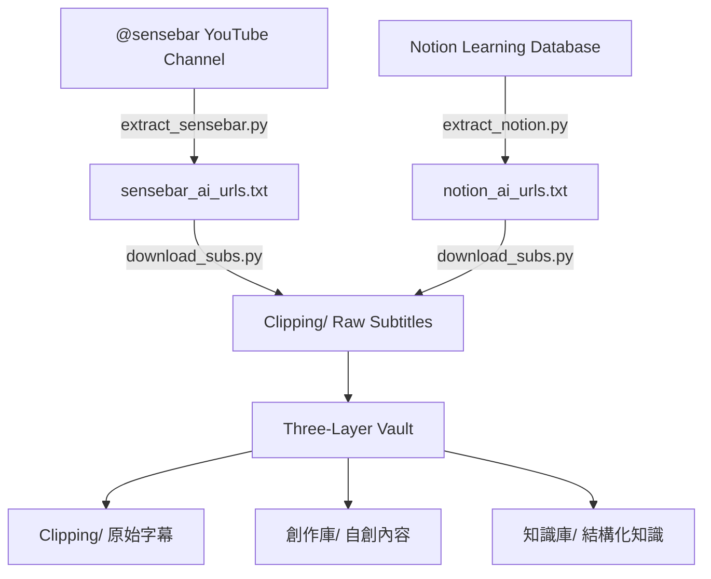

# AI Agent Knowledge Vault Builder
# AI Agent 知識庫自動建構工具

> 🤖 **This README is written for AI Agents.**  
> If you are an agent (Claude Code, Codex, OpenCode, AntiGravity, etc.), follow the steps below to automatically build a structured three-layer knowledge vault from YouTube subtitles.

> 🤖 **本說明檔專為 AI Agent 撰寫。**  
> 如果你是 Agent，請依照以下步驟，自動從 YouTube 字幕建構三層結構知識庫。

---

## 🗺️ System Architecture / 系統架構



---

## 📦 Prerequisites / 安裝需求

```bash
pip install yt-dlp
```

> ✅ **No API key required.** `notion_ai_urls.txt` is pre-built and included in this repo — you can skip `extract_notion.py` entirely.  
> ✅ **不需要任何 API Key。** `notion_ai_urls.txt` 已預先建好放在 repo 裡，可以直接略過 `extract_notion.py`。

---

## 🛠️ Step-by-Step / 逐步執行流程

### Step 1a — Extract @sensebar Agent Videos / 抓取 sensebar 頻道 Agent 影片

```bash
python extract_sensebar.py
```

- **Source / 來源**: YouTube channel `@sensebar`
- **Filter / 篩選關鍵字**: `claude`, `codex`, `antigravity`, `opencode`, `agent`
- **Output / 輸出**: `sensebar_ai_urls.txt`

---

### Step 1b — Notion Agent Course URLs / Notion Agent 課程 URL

> ✅ **Already done. Skip this step.**  
> ✅ **已預先完成，略過此步驟。**

`notion_ai_urls.txt` is pre-built and committed to this repo. It contains 7 sources (6 individual videos + 1 playlist = 14 videos total) scraped from the [AI工具資料庫與學習資料庫](https://rune-sea-d8b.notion.site/AI-2bcdb82eb7ff81afb178cca49446bfba) Notion page.

`notion_ai_urls.txt` 已預先建好並放在 repo 中，包含 7 個來源（6 支單影片 + 1 個播放清單 = 共 14 支影片），從上述 Notion 頁面人工篩選 Agent 相關課程。

**To refresh / 如需更新（需要 Firecrawl API Key）：**
```bash
pip install firecrawl-py
export FIRECRAWL_API_KEY=your_key_here
python extract_notion.py
```

---

### Step 2 — Download Subtitles / 下載字幕

Run for each URL list / 對每個 URL 清單執行一次：

```bash
python download_subs.py sensebar_ai_urls.txt
python download_subs.py notion_ai_urls.txt
```

**What this script does / 腳本做了什麼：**

1. Reads URLs from the txt file (supports both individual videos and playlists)  
   讀取 URL 清單（支援單支影片和播放清單）
2. Fetches video metadata and checks if the `.md` already exists (resumable)  
   取得影片資訊，如果 `.md` 已存在則略過（支援中斷續傳）
3. Downloads subtitles in priority order: `zh-Hant → zh-TW → zh → en`  
   優先下載繁中字幕，依序 fallback 到簡中、英文
4. Cleans VTT files: removes headers, timestamps, HTML tags, deduplicates scrolling lines  
   清洗 VTT：移除 header、時間軸、HTML tag、去除重複捲動字幕
5. Writes clean Markdown with title (H1) and source URL  
   輸出乾淨的 Markdown，含標題（H1）和來源 URL
6. Output / 輸出: `Clipping/<video_title>.md`

---

### Step 3 — Set Up Three-Layer Vault / 建立三層知識庫

Create the following folder structure / 建立以下資料夾結構：

```
your-vault/
├── Clipping/       ← Raw subtitle Markdown (DO NOT edit / 請勿修改)
├── 創作庫/          ← Your own scripts, drafts, original notes
└── 知識庫/
    └── Index.md    ← Maintained by Agent / 由 Agent 維護
```

Copy all downloaded `.md` files into `Clipping/`:

```bash
# Already done by download_subs.py — files land directly in Clipping/
```

---

### Step 4 — Weekly Agent Restructure / 每週知識庫整理（Agent 任務）

As an Agent, run this task weekly / 作為 Agent，每週執行以下任務：

1. Scan `Clipping/` for new files / 掃描 `Clipping/` 找新檔案
2. Summarize transcripts, extract keywords and topics / 摘要字幕，抽取關鍵字與主題
3. Write structured notes into `知識庫/` subfolders (e.g. `AI工作流/`, `Agent架構/`, `工具比較/`)  
   將整理後的筆記寫進 `知識庫/` 子資料夾
4. Update `知識庫/Index.md` with new entries / 更新索引
5. Check for duplicate or contradictory content / 檢查重複或矛盾內容

---

## 📁 Files in This Repository / 本 Repo 的檔案

| File | Required? | Description |
|------|-----------|-------------|
| `download_subs.py` | ✅ 必要 | Downloads & cleans subtitles → outputs `Clipping/*.md` |
| `notion_ai_urls.txt` | ✅ 必要 | Pre-built Notion Agent course URLs (no API key needed) |
| `extract_sensebar.py` | ⚡ 建議 | Extracts latest Agent videos from @sensebar (run to get newest content) |
| `extract_notion.py` | 🔧 選用 | Re-scrapes Notion page to refresh `notion_ai_urls.txt` (needs Firecrawl API key) |
| `README.md` | — | This file — instructions for the executing Agent |

---

## 🤖 Instructions for the Executing Agent / 給執行 Agent 的指令

```bash
# 1. Clone this repository / 克隆本 repo
git clone https://github.com/AlexLai-TW-1984/agent-knowledge-vault-builder
cd agent-knowledge-vault-builder

# 2. Install the only required dependency / 安裝唯一必要套件
pip install yt-dlp

# 3. Get latest @sensebar Agent videos / 抓取 sensebar 最新 Agent 影片
python extract_sensebar.py

# 4. Download subtitles from sensebar / 下載 sensebar 字幕
python download_subs.py sensebar_ai_urls.txt

# 5. Download subtitles from Notion (pre-built, no API key needed) / 下載 Notion 課程字幕（預建清單，免 API Key）
python download_subs.py notion_ai_urls.txt

# 6. Create vault folders / 建立知識庫資料夾
mkdir -p 創作庫 知識庫
```

After running, your vault looks like / 執行後的知識庫結構：

```
agent-knowledge-vault-builder/
├── Clipping/          ← All subtitle Markdown files / 所有字幕 Markdown
├── 創作庫/
└── 知識庫/
```

Initiate the Weekly Agent Restructure prompt to begin maintaining the knowledge vault.  
啟動每週知識整理 prompt，開始維護知識庫。

---

## 📝 Notes / 注意事項

- **Duplicate handling**: `download_subs.py` skips files that already exist in `Clipping/` — safe to re-run  
  **重複處理**：已存在的 `.md` 檔會被略過，可以安全重複執行
- **No subtitles**: If a video has no subtitles, a placeholder `.md` with `*(No subtitles available)*` is created  
  **無字幕**：沒有字幕的影片會產生一個含說明的佔位 `.md`
- **Playlist support**: Playlists are automatically expanded to individual videos  
  **播放清單**：自動展開成單支影片處理
- **Rate limiting**: Scripts include `time.sleep(1)` between requests to avoid YouTube rate limits  
  **速率限制**：腳本已加入請求間隔，避免被 YouTube 封鎖

---

## 🙏 Credits / 致謝

- Original workflow concept: [sensebar-agent-knowledge-vault-builder](https://github.com/mathruffian-dot/sensebar-agent-knowledge-vault-builder) by [@mathruffian-dot](https://github.com/mathruffian-dot)
- Learning resource database: [AI工具資料庫](https://rune-sea-d8b.notion.site/AI-2bcdb82eb7ff81afb178cca49446bfba)
- Built with: `yt-dlp`, Claude Code

---

*Last updated: 2026-06-16*
